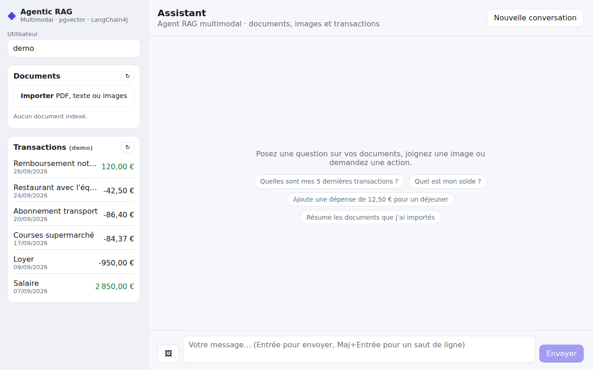

# Agentic Multi-Modal RAG

Assistant conversationnel **agentique** et **multimodal** : il répond à partir de vos documents
(PDF, texte, **images**), et agit sur des données métier (transactions) grâce au *tool calling*.



| Couche      | Technologies |
|-------------|--------------|
| Backend     | Java 21, Spring Boot 4.1, LangChain4j 1.0 (AiServices, tools, RAG), Flyway, JPA |
| IA          | OpenAI GPT-4o (chat + vision), `text-embedding-3-small` |
| Stockage    | PostgreSQL 16 + **pgvector** (embeddings) |
| Frontend    | Angular 20 (standalone, signals, zoneless) |

## Architecture

```
Angular ──/api──▶ ChatController ─▶ ChatService ─▶ Assistant (LangChain4j AiServices)
                                         │               ├─ mémoire par conversation
                                         │               ├─ ContentRetriever (RAG auto, pgvector)
                                         │               └─ Tools : searchDocuments,
                                         │                  listRecentTransactions, getBalance,
                                         │                  createTransaction
                                         └─ ImageDescriptionService (GPT-4o vision)
                 IngestionController ─▶ RagIngestionService
                                         PDF/texte ─▶ parser ┐
                                         image ─▶ vision ────┴▶ chunking ▶ embeddings ▶ pgvector
```

* **RAG multimodal** : les images (à l'ingestion comme dans le chat) sont décrites par GPT-4o vision,
  puis la description est indexée / injectée comme du texte.
* **Agentique** : le LLM choisit seul d'appeler les tools. Les tools métier agissent toujours pour
  l'utilisateur de la requête (`CurrentUser`), jamais pour un identifiant fourni par le LLM : une
  injection de prompt ne peut pas lire les données d'un autre utilisateur.
* **Traçabilité** : chaque réponse renvoie les sources RAG utilisées (fichier, extrait, score) et
  les tools exécutés, affichés dans l'interface.

## Démarrage rapide

Prérequis : Docker, et une clé OpenAI.

### Tout en Docker

```bash
export OPENAI_API_KEY=sk-...
docker compose --profile app up --build
```

Interface : http://localhost:4200 — API : http://localhost:8080

### En développement

```bash
# Backend (démarre automatiquement le Postgres/pgvector de compose.yaml)
cd rag-backend
export OPENAI_API_KEY=sk-...
./mvnw spring-boot:run

# Frontend (proxy /api → localhost:8080)
cd frontend
npm install
npm start
```

Sans Docker, pointez vers votre propre PostgreSQL avec pgvector (`DB_HOST`, `DB_PORT`, `DB_NAME`,
`DB_USER`, `DB_PASSWORD`) et désactivez l'intégration compose : `SPRING_DOCKER_COMPOSE_ENABLED=false`.

Sans `OPENAI_API_KEY`, l'application démarre, mais le chat et l'ingestion renvoient une erreur 502
explicite.

## API

| Méthode | Route | Description |
|---------|-------|-------------|
| `POST` | `/api/chat` (JSON) | `{conversationId, userId?, message}` → `{reply, sources[], toolsUsed[]}` |
| `POST` | `/api/chat` (multipart) | idem + `image` jointe (décrite par le modèle de vision) |
| `DELETE` | `/api/chat/{conversationId}` | Efface la mémoire de la conversation |
| `POST` | `/api/documents` (multipart) | `file`, `ownerId?` — PDF, texte (`.txt .md .csv .json .xml .html`) ou image |
| `GET` | `/api/documents` | Documents indexés (nombre de segments, date…) |
| `DELETE` | `/api/documents/{documentId}` | Retire un document de la base vectorielle |
| `GET` | `/api/transactions?userId=demo` | Dernières transactions |
| `POST` | `/api/transactions` | Crée une transaction |

Les erreurs suivent le format RFC 7807 (`application/problem+json`).

Exemple :

```bash
curl -F file=@rapport.pdf localhost:8080/api/documents
curl -H 'Content-Type: application/json' localhost:8080/api/chat \
  -d '{"conversationId":"c1","message":"Résume le rapport puis donne mon solde"}'
```

## Configuration (`rag-backend/src/main/resources/application.yml`)

| Propriété | Défaut | Rôle |
|-----------|--------|------|
| `app.ai.openai.chat-model` | `gpt-4o` | Modèle de chat (doit supporter la vision pour les images) |
| `app.ai.openai.embedding-model` | `text-embedding-3-small` | Modèle d'embeddings (dimension déduite : 1536 / 3072 pour `-large`) |
| `app.ai.rag.max-results` / `min-score` | `5` / `0.6` | Paramètres du retriever |
| `app.ai.rag.chunk-size` / `chunk-overlap` | `500` / `50` | Découpage des documents |
| `app.ai.memory.max-messages` | `20` | Fenêtre de mémoire conversationnelle |
| `app.cors.allowed-origins` | `http://localhost:4200` | Origines CORS (`CORS_ALLOWED_ORIGINS`) |

Un jeu de transactions de démonstration est créé pour l'utilisateur `demo` (migration Flyway `V2`).

Pour passer sur un modèle local (LLaMA 3 via Ollama), ajoutez `langchain4j-ollama` et remplacez les
beans `OpenAiChatModel` / `OpenAiEmbeddingModel` dans `AiConfig`.

## Tests

```bash
cd rag-backend && ./mvnw verify      # unitaires, slices web, intégration pgvector (Testcontainers, nécessite Docker)
cd frontend && npx ng test --no-watch --browsers=ChromeHeadlessCI
```

Le test d'intégration exécute le pipeline complet sur un vrai PostgreSQL/pgvector (migrations,
ingestion, recherche vectorielle, catalogue, tools et boucle agentique AiServices) avec des modèles
simulés : aucune clé OpenAI n'est nécessaire.

## Limites connues / pistes

* Mémoire conversationnelle en RAM (`InMemoryChatMemoryStore`) : à remplacer par Redis/JDBC en prod.
* Pas d'authentification : `userId` est fourni par le client. Brancher Spring Security et dériver
  l'utilisateur du jeton pour un usage réel.
* Les PDF scannés (sans couche texte) sont refusés : envoyez les pages en images.
